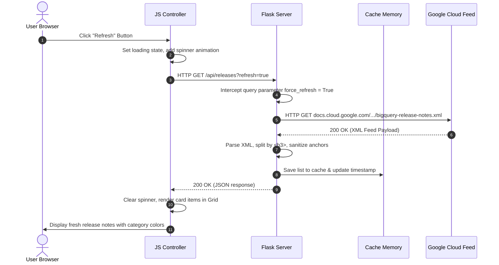

# Project Architecture & Deep Dive Guide

This document provides a detailed breakdown of the BigQuery Release Explorer, highlighting its primary features, server and client divisions, and tracing the lifecycle of key requests and responses.

---

## 🌟 Main Features

1.  **Granular Release Feed Parsing**: Separates daily updates (entries) into distinct items based on category headings (`<h3>` tags).
2.  **Interactive Filter & Search**: Direct client-side filtering by categories (`Features`, `Announcements`, `Issues & Fixes`, `Deprecations`) and instant text searching.
3.  **Local Caching System**: Retains parsed notes in memory (1-hour TTL) for swift load speeds and minimal external network reliance.
4.  **Multi-Selection & Batch Tweeting**: Checkbox states allow selecting multiple updates to draft custom digests or single-item tweets.
5.  **Modal Tweet Composer**: Built-in editor featuring real-time length tracking against X/Twitter's 280-character cap.

---

## 🖥️ Server-Side Breakdown (`app.py`)

The backend is built with Python 3.12 and Flask. It acts as an API gateway and static page host.

### 1. Routing & Views
*   `GET /`: Serves the static [templates/index.html](file:///F:/LearnWS/AntiGravityIDE/my-first-proj/templates/index.html) file.
*   `GET /api/releases`: Serves a JSON list of parsed release notes. Accepts a `?refresh=true` query parameter to force feed refresh.

### 2. Caching Mechanism
*   **Memory Cache**: Uses an in-memory dictionary `_cache` storing `data` and `last_updated` (Unix timestamp).
*   **Duration**: Configured to `3600` seconds (1 hour). If the request doesn't force a refresh and the cache is warm, the server skips fetching the external Google feed.

### 3. XML Parser & Sanitizer ([parse_feed_source](file:///F:/LearnWS/AntiGravityIDE/my-first-proj/app.py#L39))
*   **Feedparser**: Handles extraction of `<entry>` collections, isolating title dates, update timestamps, links, and summaries.
*   **BeautifulSoup**:
    *   Finds all `<h3>` headings inside the HTML content block.
    *   Divides subsequent HTML elements into specific update records associated with the target category.
    *   Sanitizes and enforces `target="_blank"` and `rel="noopener noreferrer"` attributes on all custom anchor (`<a>`) links.

---

## 📱 Client-Side Breakdown (`templates/index.html`)

The frontend is a single-page app utilizing native HTML5, JavaScript, and custom Vanilla CSS.

### 1. Visual Aesthetics & styling
*   **Background**: Radial backdrop with deep blue-to-black gradient and glowing blur orbs.
*   **Glassmorphic Container**: Backdrop blur (`blur(12px)`) with transparent white border lines for cards.
*   **Responsive Grid**: CSS grid adjusting columns automatically based on screen widths.

### 2. UI State Management (Vanilla JavaScript)
*   `releases`: Array storing the JSON payload received from the backend API.
*   `selectedIds`: A native ES6 `Set` containing the IDs of checked updates.
*   `currentFilter` & `searchQuery`: Input states that recalculate visible items in real-time.

### 3. Sharing Bridge
*   **Drafting Generator**: Formulates templates based on selection size:
    *   *Single*: Shows full title, category, description chunk, and docs link.
    *   *Multiple*: Outputs a numbered list of category headers and short descriptions.
*   **Web Intent**: Compiles the final draft text into a query string and directs the user to:
    `https://twitter.com/intent/tweet?text=ENCODED_MESSAGE`

---

## 🔄 Sample Request/Response Flow: Loading & Refreshing

This walkthrough traces what happens when a user clicks the **Refresh** button on the UI.

### Step-by-Step Execution Sequence



### 1. Client Action
The user triggers the click handler on `#refreshBtn`. JavaScript appends the `.spinning` CSS class to the icon, disables the button, and calls:
```javascript
fetch('/api/releases?refresh=true')
```

### 2. Backend Interception
The Flask route `/api/releases` identifies `request.args.get('refresh') == 'true'` and calls `get_release_notes(force_refresh=True)`:
*   Bypasses the `_cache` validation check.
*   Triggers `parse_feed_source()`.

### 3. XML Extraction
`parse_feed_source()` sends a request to Google Cloud Feed:
```python
feed = feedparser.parse("https://docs.cloud.google.com/feeds/bigquery-release-notes.xml")
```
It iterates entries:
*   Finds entry date: `"June 17, 2026"`
*   Separates HTML details by headings:
    *   `<h3>Feature</h3>` -> Sibling nodes -> Item A.
    *   `<h3>Issue</h3>` -> Sibling nodes -> Item B.

### 4. API JSON Response
The server updates the global cache and responds with the following payload structure:
```json
{
  "success": true,
  "releases": [
    {
      "id": "tag:google.com,2016:bigquery-release-notes#June_17_2026#0",
      "date": "June 17, 2026",
      "category": "Feature",
      "content": "<p>You can enable autonomous embedding generation...</p>",
      "link": "https://docs.cloud.google.com/bigquery/docs/release-notes#June_17_2026"
    }
  ],
  "last_updated": 1782052560.124
}
```

### 5. Client Rendering
The frontend UI controller:
1.  Clears existing list and loading skeletons.
2.  Iterates the `releases` array, filtering matches based on `#searchInput` and `currentFilter`.
3.  Injects styled card templates into the grid container `#feedContainer`.
4.  Removes the `.spinning` animation class.
